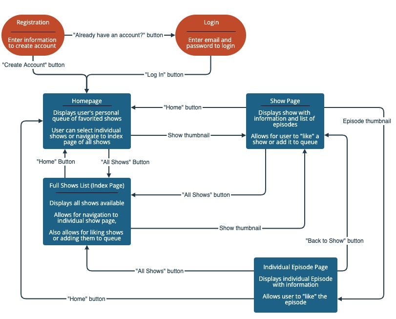

<h1>QUELUE</h1>

Quelue is an application meant to recreate certain functionalities of Hulu and improve on the user experience. Specifically, we have found that navigating to a list of episodes in Hulu is rather confusing. In our application, we aimed to make this process easier and more convenient for the user.

   
<h2>Live Link: http://quelue.herokuapp.com/</h2>
   
<h2>User Stories</h2>

The user can register for an account for an online streaming service. They will be able to discover shows, watch shows, and have a personal queue of shows. They will have the option to view the details of a series before they start watching. The user will be able to easily navigate between different episodes of a series, which is something that other major streaming services can benefit from. If the user has shows in their queue, they will see them on their homepage for easy access.

        

<h2>Technologies Used</h2>

<ul>

</ul>
<li>This application was created from scratch using Express/Node.js to build the basic server functionality. </li>
<li>Model View Controller (MVC) framework to organize our code into a scalable and extensible application.</li>
<li>Representation State Transfer (REST) routing style to map the HTTP routes and Create, Read, Update, and Delete (CRUD) functionalities.</li>
<li>MongoDB to hold our database, and Mongoose was used as the Object Data Modeling library for Node.js and MongoDB. </li>
<li>Express-session is used to create cookies to store session id's for the user currently logged in. Connect-mongo stores the sessions when users log out. </li>
<li>dotenv to separate our secrets from our source code, and bcryptjs was used to hash and salt all passwords for security. </li>
<li>All pages are rendered dynamically with EJS, and method-override is used to provide the PUT and DELETE methods. </li>
<li>Sass preprocessor scripting language to compile Cascading Style Sheets.</li>

<h2>Approach</h2>
        

Quelue was built beginning with the server and models of the three Schema that organize all of our data: Users, Shows, and Episodes. Shows share a one-to-many relationship with Episodes, and Users share a many-to-many relationship with Shows as shown below:

We wanted to facilitate a smooth user flow from page to page, with logical options for navigating the site as shown in this diagram:

In addition, various routes were added in the auth_controllers to logically send users to the correct page based on whether they logged in or edited their profile correctly. Click the link below to see the wireframes from the planning stage for Quelue: 

<a href="https://app.moqups.com/F5C4yNrilp/view/page/af4dcfefd">Wire-Frames</a>

<h2>For the next iteration...</h2>

<ul>
   <li>Originally, we conceived a system where episodes could be 'liked' and added to a user's list of 'liked' items on their homepage. Each episode would also track the total likes from all users. With the time alotted, we were unable to track the likes without interfering with the show's queue system, so we left it out of the final project. </li>
   <li>Auth: Prevent users from leaving account information blank.</li>
   <li>Separate the form to update profile from update password.</li>
   <li>Sizing the thumbnail images in a standard size proved to be challenging without ruining the quality of the picture.</li>
</ul>
